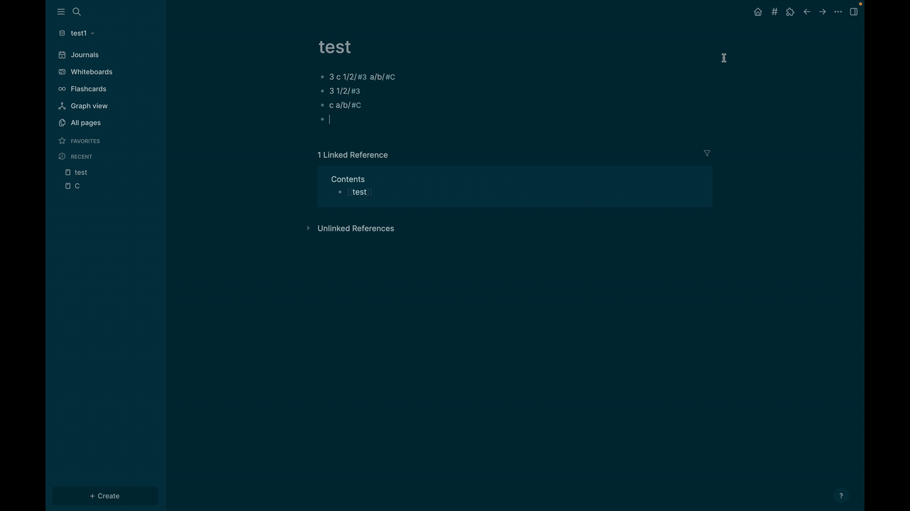

# Tag Tree — Hierarchical Tags for Logseq / Logseq 层级标签插件

Tag Tree is a hierarchical tags management panel for Logseq, built around a plain-text inline tag syntax: write tags as `a/b/#c` directly in your blocks, and browse, filter, and reorganize them in a tree.

Tag Tree 是一个 Logseq 层级标签管理面板，核心是一套纯文本行内标签语法：在块里直接写 `a/b/#c`，然后在树形面板中浏览、筛选和整理它们。

## 🎬 Demo / 演示

**Basic operations / 基本操作** — creating hierarchical tags, renaming, moving (drag & drop), merging, removing:
**基本操作** —— 创建层级标签、重命名、拖拽移动、合并、移除：

**Tag filtering / 标签筛选** — AND/OR includes, excludes, and match results:
**标签筛选** —— 包含（且/或）、排除与匹配结果：

---

## 📖 Tag Syntax / 标签语法

| Syntax / 写法 | Meaning / 含义 |
|---|---|
| `#c` | Root-level tag, concept `c` / 根级标签 |
| `a/b/#c` | Hierarchical tag: path `a/b`, concept `c` / 层级标签：路径 `a/b`，概念 `c` |
| `#a/b/c` (legacy) | Auto-normalized to `a/b/#c` / 旧写法，自动规范化 |

- **The last segment is the concept** — `a/b/#c`, `D/#c` and `#c` all resolve to the same concept page `c`. Tags are grouped by path in the tree, but the concept is shared.
- **One line, many tags** — a single block can carry multiple inline tags: `a/b/#c D/#c F/#c`.
- **Plain text storage** — tags live in the block text itself, no block properties involved, so everything stays visible and portable.
- **Legacy migration** — old `#a/b/c` tags are rewritten to `a/b/#c` automatically as you edit (can be disabled), or in bulk via the context-menu migration command.

- **末段即概念** —— `a/b/#c`、`D/#c`、`#c` 都指向同一个概念页面 `c`；树中按路径分组，概念共享。
- **一行多标签** —— 同一个块可以带多个行内标签：`a/b/#c D/#c F/#c`。
- **纯文本存储** —— 标签就是块内原文，不依赖块属性，可见、可迁移。
- **旧格式迁移** —— 旧式 `#a/b/c` 会在编辑时自动改写为 `a/b/#c`（可关闭），也可通过右键菜单批量迁移。

## ✨ Features / 功能

- **Tree panel** — all tags grouped by path/concept, with per-tag usage counts
- **Search & navigation** — real-time filter, expand/collapse all, click a tag to open its concept page
- **Drag & drop reordering** — reorder siblings or drop onto a parent to nest; order is persisted
- **Full tag operations** — rename / move / merge / delete, each with a plan preview before writing; renaming can also rename the concept page
- **Tag filtering** — 且 / 或 (AND/OR) includes plus excludes (⊘); concepts match under any path, paths match whole subtrees; matched blocks and `tags::` pages are listed and clickable, and can be copied as a Markdown list (block references + page links) with one click
- **Usage browser** — click a tag to see every block and `tags::` page carrying it; click an entry to jump to the block
- **Auto refresh** — the panel tracks graph changes (debounced) and offers a manual refresh button
- **Theme aware** — follows Logseq light/dark mode; colorful / simple styles available

- **树形面板** —— 按路径/概念分组展示全部标签，带使用计数
- **搜索与导航** —— 实时过滤、一键展开/折叠、点击标签打开概念页面
- **拖拽排序** —— 同级排序或拖到父节点下嵌套，顺序持久化
- **完整标签操作** —— 重命名/移动/合并/删除，均先预览写入方案；重命名可同步重命名概念页面
- **标签筛选** —— 包含（且/或）+ 排除；概念匹配任意路径、路径匹配整个子树；命中块与 `tags::` 页可点击跳转，也可一键复制为 Markdown 列表（块引用 + 页面链接）
- **用量浏览** —— 点击标签查看所有携带它的块和页面，点击条目定位到块
- **自动刷新** —— 监听图谱变更（防抖），并提供手动刷新按钮
- **主题适配** —— 跟随 Logseq 明暗模式，提供彩色/简洁两种风格

---

## 🚀 Installation / 安装

### Option A: Logseq Marketplace / 选项A：Logseq 插件市场
1. Open Logseq → Settings → Plugins → Marketplace
2. Search for **"Tag Tree"**
3. Click Install

### Option B: Manual / 选项B：手动安装
1. Download the latest zip from [GitHub Releases](https://github.com/xiantiao/logseq-plugin-tag-tree/releases)
2. Unzip it
3. In Logseq: Settings → Plugins → Load unpacked plugin, select the unzipped folder

---

## 🎮 Usage / 使用方法

- **Open the panel**: click the `#` toolbar button, run "Open Tags Panel" from the command palette, or press the shortcut (default `mod+shift+t` / `Cmd/Ctrl+Shift+T`)
- **Browse**: click arrows to expand/collapse; click a tag name to open its concept page; click the usage count to see all blocks
- **Organize**: right-click a tag for rename / move / merge / delete / migrate; drag to reorder or nest
- **Filter**: click the funnel icon in the toolbar, then left-click tags to include, right-click to exclude; toggle 且/或 by clicking the badge; copy results with the 复制 button

- **打开面板**：工具栏 `#` 按钮、命令面板 "Open Tags Panel"，或快捷键（默认 `mod+shift+t`）
- **浏览**：箭头展开/折叠；点击标签名打开概念页；点击计数查看所有块
- **整理**：右键标签进行重命名/移动/合并/删除/迁移；拖拽排序或嵌套
- **筛选**：点击工具栏漏斗图标进入筛选模式，左键包含、右键排除，点击徽标切换且/或，「复制」按钮导出结果

---

## ⚙️ Settings / 设置

Settings live in Logseq's native plugin settings: **Settings → Plugins → Tag Tree → Settings**.

- **Theme style** — colorful / simple / 彩色 / 简洁
- **Keyboard shortcut** — e.g. `mod+shift+t`, `alt+t` / 打开面板的快捷键
- **Auto normalize legacy tags** — rewrite `#a/b/c` to `a/b/#c` while editing / 编辑时自动规范化旧式层级标签

See [SETTINGS.md](SETTINGS.md) for details.

---

## 🙏 Acknowledgements / 致谢

This plugin builds upon [gidongkwon/logseq-plugin-tags](https://github.com/gidongkwon/logseq-plugin-tags) (published in the marketplace as "Enhanced Tags", MIT License) — thanks for the excellent foundation. The storage model was later fully redesigned around inline hierarchical text (`a/b/#c`).

本插件基于 [gidongkwon/logseq-plugin-tags](https://github.com/gidongkwon/logseq-plugin-tags)（市场名 "Enhanced Tags"，MIT 许可证）开发，感谢原作者打下的优秀基础。其后存储模型被完全重设计为行内层级文本（`a/b/#c`）。

## 📄 License / 许可证

MIT License
